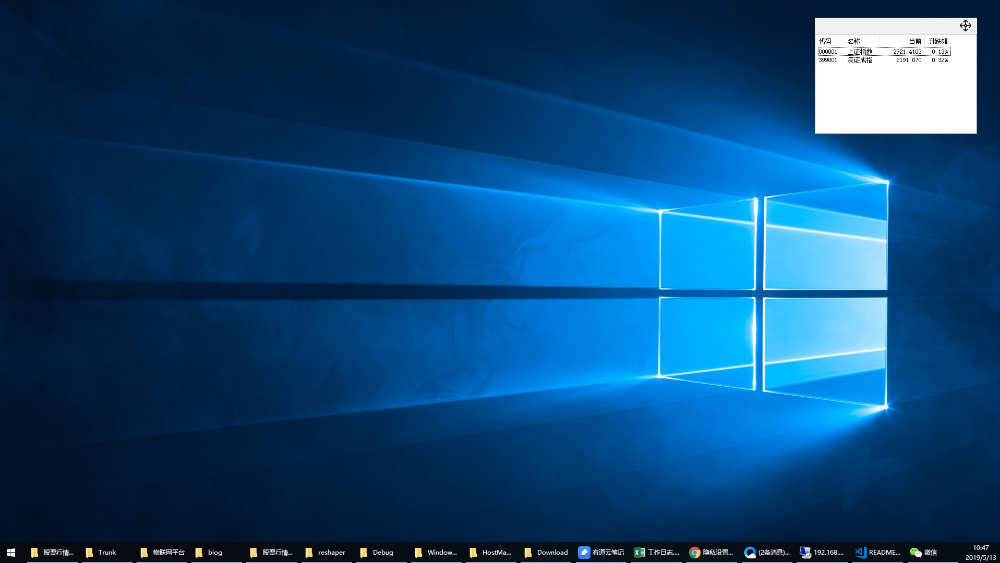

# WindowsClock
windows桌面股票工具  
一直没有找到一个很合适的桌面股票小工具，就利用业余时间自己开发一下，想要什么样的功能自己增加。
也觉得很有意义。

网上找了‘蓝光迷你股票’，界面非常不错，但是发现，一直在最上方，不是我想要的。  	

界面比较简单，但能满足要求，以后再完善。  




# 功能说明
1.可以增加自选股票。在安装目录下有一个xml文件

```xml
<?xml version="1.0" encoding="utf-8"?>
<ArrayOfMyStock xmlns:xsi="http://www.w3.org/2001/XMLSchema-instance" xmlns:xsd="http://www.w3.org/2001/XMLSchema">
    <MyStock>
        <type>sh</type>
        <code>000001</code>
        <name>上证指数</name>
    </MyStock>
    <MyStock>
        <type>sz</type>
        <code>399001</code>
        <name>深证指数</name>
    </MyStock>
</ArrayOfMyStock>
```


